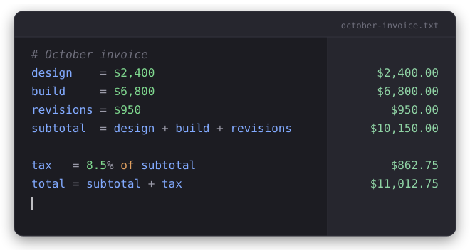

# TallyPad

A local-only, notepad-style calculator inspired by [Soulver](https://soulver.app/). Type lines of math with
named variables and see results next to each line, live. 100% offline. No accounts,
no network, no telemetry.

<picture>
  <source media="(prefers-color-scheme: dark)" srcset="assets/hero-dark.svg">
  <source media="(prefers-color-scheme: light)" srcset="assets/hero-light.svg">
  
</picture>

## Features
- Variables, references, and redefinition across lines
- Arithmetic with precedence and parentheses, unary minus
- Thousands separators (`10,000`) and percentages (`20%`, `20% of total`)
- Currency symbols (`$`, `€`, `£`, `¥`) carried through a calculation and formatted on results
- A bare `sum` line totals the value lines above it, back to the last blank line
- Exponents (`^`) and built-ins: `sqrt`, `abs`, `round`, `min`, `max`
- `#` / `//` comments and blank lines preserved
- Light/dark themes (defaults to dark), remembered across launches
- Autosave + restore; open/save plain `.txt` files
- Click any result to copy it to the clipboard
- No third-party runtime dependencies; the calculation engine is a small hand-written parser

## Run from source
```bash
npm install
npm start
```

## Test
```bash
npm test   # runs the engine + settings unit tests via node --test
```

## Build
```bash
npm run dist:linux   # AppImage — built and verified on Linux
```

### macOS / Windows
The app is pure JavaScript and cross-platform, but installers must be built **on their
own OS** (or CI). From a Mac: `npm run dist:mac` (`.dmg`). From Windows:
`npm run dist:win` (NSIS `.exe`). These targets cannot be produced or verified from Linux.

## Omarchy / Hyprland
See `build/hyprland-keybind.conf` for a `SUPER + C` launch keybind.

## License
MIT — see [LICENSE](LICENSE).
